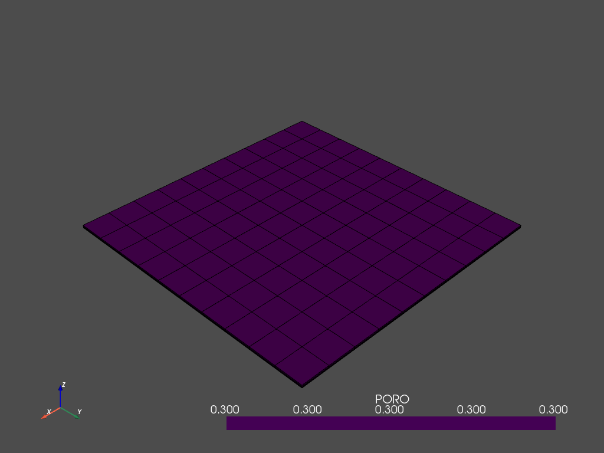

# Reservoir Simulation Read Eclipse file


```python
import resimpy as sim
import numpy as np 
from shapely.geometry import Point
from scipy import stats
```


```python
m = sim.Grid()
m
```


    Grid(grid_type=None, nx=None, ny=None, nz=None, tops=None, dx=None, dy=None, dz=None, origin=<shapely.geometry.point.Point object at 0x7fba802e6250>, azimuth=0, dip=0, plunge=0, coord=None, zcorn=None, spatial_data=None, skiped_keywords=0)


```python
m.read_GRDECL('./SPE1CASE1.DATA')
```

    [Input] Reading ECLIPSE/PETREL file "./SPE1CASE1.DATA" ....
    Num Keywords 73
    DIMENS
         Grid Type=GridTypeEnum.cartesian Grid
         Grid Dimension(NX,NY,NZ): (10 x 10 x 3)
         NumOfGrids=300
         NumOfKeywords=73
         Reading Keyword 1 [DIMENS] 
    
    OIL
    WELLDIMS
    DX
    ------DX------
    DY
    ------DY------
    DZ
    ------DZ------
    TOPS
    ------TOPS------
    PORO
    ------PORO------
         [PORO] PERMX
    ------PERMX------
         [PERMX] PERMY
    ------PERMY------
         [PERMY] PERMZ
    ------PERMZ------
         [PERMZ] PROPS
    ROCK
    SWOF
    SGOF
    DENSITY
    PVDG
    PVTO
    0.0905
    0.1800
    0.3710
    0.6360
    0.7750
    0.9300
    1.2700
    1.6180
    
    SOLUTION
    RSVD
    SUMMARY
    FGOR
    10
    
    BGSAT
    1
    1
    10
    10
    10
    10
    10
    10
    
    WBHP
    WGIR
    WGIT
    WGPR
    WGPT
    WOIR
    WOIT
    WOPR
    WOPT
    WWIR
    WWIT
    WWPR
    WWPT
    SCHEDULE
    RPTRST
    DRSDT
    WELSPECS
    'INJ'
    
    COMPDAT
    'INJ'
    
    WCONPROD
    
    WCONINJE
    
    TSTEP
    
    .....Done!


```python
m.get_vtk().plot(show_edges=True)
```

    /home/scuervo/Documents/dev/apps/resimpy/resimpy/grid.py:913: UserWarning: VTK 9 no longer accepts an offset array
      grid = pv.UnstructuredGrid(offset, cells, cell_type, points)


    

    


    [(20773.89702453446, 20773.89702453446, 24148.89702453446),
     (5000.0, 5000.0, 8375.0),
     (0.0, 0.0, 1.0)]


